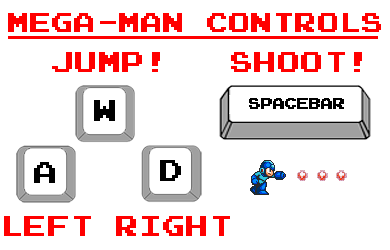

## Mega Man

### Background

**Mega Man** was released in 1987 on the NES (Nintendo Entertainment System).  The original video game remains an enduring and timeless classic, marking the start of a franchise that would to date sell over 30 million copies worldwide.  The Mega Man franchise has become one of the most well known video game franchises of all time and continues to owe much of its current game mechanics to the original.

This project intends to showcase a basic set of features that defines this classic jump & run genre game using plain javascript:
- side to side scrolling (with the help of Canvas)
- character animation (sprites)
- music and interactive sound (with the help of Howler)
- movement and lifepoints (plain javascript)

### Functionality & MVP  

The project implementation should allow the user to:

- to move the character in 2D (running side-to-side, jumping up and down)
- start, pause, restart gameplay
- complete at least one level where the goal is defeat an ai enemy of some kind
- mute music and sound

This project will also include:

- a production **README**
- a pictographic control description
- my own social media links

### Selected Code

Putting different background music into an array allows for rotating through them.

```javascript
let musicChibi = new Howl({
  src: 'sounds/music/chibi.mp3',
  autoplay: false,
  loop: true,
  volume: 1,
});
...

export const music = [musicChibi, musicDigital, musicResistors, victory];
music_counter = (music_counter + 1) % 3;
music[music_counter].play();
```

Time stamping the last time a bullet was fired using "cFire" and "lastFire", controls the rate at which they are shot.

Tracking the sprite's x coordinate in relation to Mega Man's x coordinate allows the hostile sprite to shoot in the correct direction.

```javascript
let cFire = new Date();
if (((cFire - this.lastFire) / 1000) > bossFiringRate && this.pos.x - game.megaman.pos.x < 23){
  let fireRight = true;
  if (this.pos.x > game.megaman.pos.x) fireRight = false;
  game.sprites.push(new Bullet(
    new VectorUtil(this.pos.x, this.pos.y), "unfriendly-bullet", fireRight
  ));
  this.lastFire = cFire;
}
```

Assigning the width of a sprite on the "spriteRoll" allows easier cycling through the sprites.

```javascript
let spriteSize = 50;
let spriteRoll = document.createElement("img");
let spriteFrameNumber = 1;
...
this.cx.drawImage(
  spriteRoll,
  (spriteFrameNumber * width), 0,
  width, height,
  x, y, width, height
);

```

### Wireframes

This app will consist of a single screen with game viewport, game controls, and links to Github, Linkedin, and my portfolio site.  

Game controls will include Start, Stop, Reset, and Mute control.


### Sprite Examples & Overlays




### Architecture and Technologies

This project will be implemented with the following technologies:

- Vanilla JavaScript and `jquery` for overall structure and game logic,
- `Canvas` for rendering,
- Webpack to bundle and serve up the various scripts
- HowlerJS to manipulate music and sound

In addition to the webpack entry file, there will be three scripts involved in this project:

`game.js`: this script will handle the logic for creating and updating the the elements of the game.

`canvas.js`: this script will handle the rendering of the game elements.

`howler.js` or `sound.js`: this script will house the logic for music and sound.

### Implementation Timeline

**Day 1**: Setup all necessary Node modules, including getting webpack up and running and `Howler.js` installed.

Create `webpack.config.js` as well as `package.json`.  Write a basic entry file and the bare bones of all 3 scripts outlined above.  Learn the basics of `Howler.js`.  

- Get a green bundle with `webpack`
- Learn enough Canvas to animate a sprite

**Day 2**: Create the elements of the game and fine tune the physics of running and jumping

- Protagonist should be able to move left and right and jump up and down
- A platform element ("Bricks") to serve as floor and walls
- Render projectiles that the protagonist can "shoot"
- An initial level where the protagonist can move about
- Have the game restart when the protagonist falls off screen

**Day 3**: Add sound

- Learn enough about `HowlerJS` to add sound when the protagonist shoots and jumps.
- Add music
- Add control to mute both sound and music
- Add enemy that jumps and shoots randomly in place at the protagonist

**Day 4**: Install the controls for the user to interact with the game.  Style the front-end, making it polished and professional.

- Create controls for the game to stop, start, reset, and toggle mute
- Have a styled page with contact links

### Bonus features

Some possible updates are:

- Add more levels
- Add more game elements (enemy types)
- Point System
- Persisting scores (arcade scoreboard)

Sprites were taken from Zetaman.  Original image in [images folder](images/Megaman_Sheet.png)
